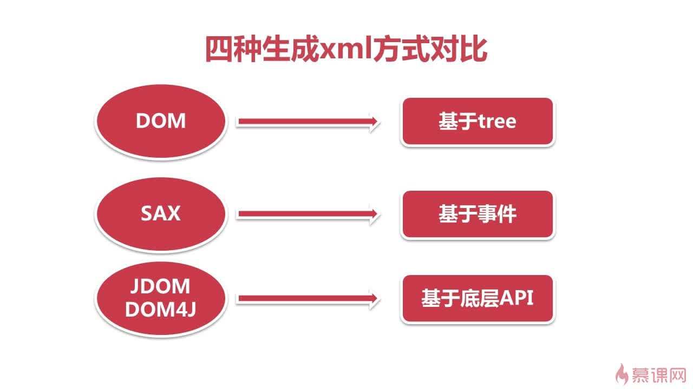
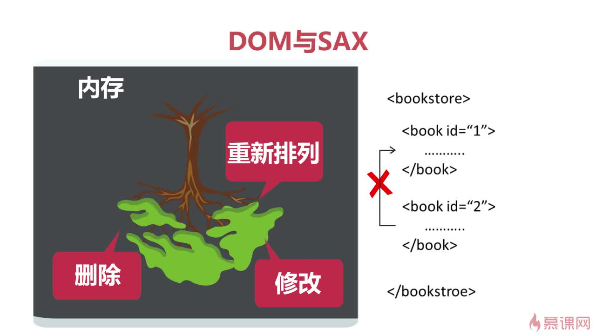

# [XML 生成](https://www.imooc.com/learn/251)

## 1. 通过 DOM 方式生成 XML 文档

```java
DocumentBuilder getDocumentBuilder() {
    DocumentBuilderFactory dbf = DocumentBuilderFactory.newInstance();
    DocumentBuilder db = null;
    try {
        db = dbf.newDocumentBuilder();
    } catch (ParserConfigurationException e) {
        e.printStackTrace();
    }
    return db;
}
```

```java
Transformer getTransformer() {
    TransformerFactory tff = TransformerFactory.newInstance();
    Transformer tf = null;
    try {
        tf = tff.newTransformer();
        tf.setOutputProperty(OutputKeys.INDENT, "yes");
    } catch (TransformerConfigurationException e) {
        e.printStackTrace();
    }
    return tf;
}
```

```java
Document document = getDocumentBuilder().newDocument();
document.setXmlStandalone(true);
Element bookstore = document.createElement("bookstore");
Element book = document.createElement("book");
book.setAttribute("id", "1");
Element name = document.createElement("name");
name.setTextContent("小王子");
book.appendChild(name);
bookstore.appendChild(book);
document.appendChild(bookstore);
Transformer tf = getTransformer();
try {
    tf.transform(new DOMSource(document), new StreamResult(new File("books3.xml")));
} catch (TransformerException e) {
    e.printStackTrace();
}
```

## 2. 通过 SAX 方式生成 XML 文档

```java
TransformerHandler getTransformerHandler() {
    SAXTransformerFactory tff = (SAXTransformerFactory) SAXTransformerFactory.newInstance();
    TransformerHandler handler = null;
    try {
        handler = tff.newTransformerHandler();
    } catch (TransformerConfigurationException e) {
        e.printStackTrace();
    }
    return handler;
}
```

```java
List<Book> bookList = parseXml();
TransformerHandler handler = getTransformerHandler();
Transformer tf = handler.getTransformer();
tf.setOutputProperty(OutputKeys.ENCODING, "UTF-8");
tf.setOutputProperty(OutputKeys.INDENT, "yes");
try {
    File f = new File("books4.xml");
    if (!f.exists()) {
        f.createNewFile();
    }
    Result result = new StreamResult(new FileOutputStream(f));
    handler.setResult(result);
    handler.startDocument();
    AttributesImpl attr = new AttributesImpl();
    handler.startElement("", "", "bookstore", attr);
    for (Book book : bookList) {
        attr.clear();
        attr.addAttribute("", "", "id", "", "1");
        handler.startElement("", "", "book", attr);
        // ...
        handler.endElement("", "", "book");
    }
    handler.endElement("", "", "bookstore");
    handler.endDocument();
} catch (SAXException | IOException e) {
    e.printStackTrace();
}
```

```java
if (book.getAuthor() != null && !"".equals(book.getAuthor().trim())) {
    attr.clear();
    handler.startElement("", "", "author", attr);
    handler.characters(book.getAuthor().toCharArray(), 0, book.getAuthor().length());
    handler.endElement("", "", "author");
}
```

## 3. 通过 DOM4J 方式生成 XML 文档

```java
Document document = DocumentHelper.createDocument();
Element rss = document.addElement("rss");
rss.addAttribute("version", "2.0");
Element channel = rss.addElement("channel");
Element title = channel.addElement("title");
title.setText("国内最新新闻");
Element title2 = channel.addElement("title2");
title2.setText("<尖括号会自动转义>");
OutputFormat format = OutputFormat.createPrettyPrint();
format.setEncoding("GBK");
File file = new File("rssNews.xml");
try {
    XMLWriter writer = new XMLWriter(new FileOutputStream(file), format);
    writer.setEscapeText(false);
    writer.write(document);
    writer.close();
} catch (IOException e) {
    e.printStackTrace();
}
```

## 4. 通过 JDOM 方式生成 XML 文档

```java
Document document = DocumentHelper.createDocument();
Element rss = document.addElement("rss");
rss.addAttribute("version", "2.0");
Element channel = rss.addElement("channel");
Element title = channel.addElement("title");
title.setText("国内最新新闻");
Element title2 = channel.addElement("title2");
title2.setText("<尖括号会自动转义>");
OutputFormat format = OutputFormat.createPrettyPrint();
format.setEncoding("GBK");
File file = new File("rssNews.xml");
try {
    XMLWriter writer = new XMLWriter(new FileOutputStream(file), format);
    writer.setEscapeText(false);
    writer.write(document);
    writer.close();
} catch (IOException e) {
    e.printStackTrace();
}
```

## 5. 不同生成方法大 PK




