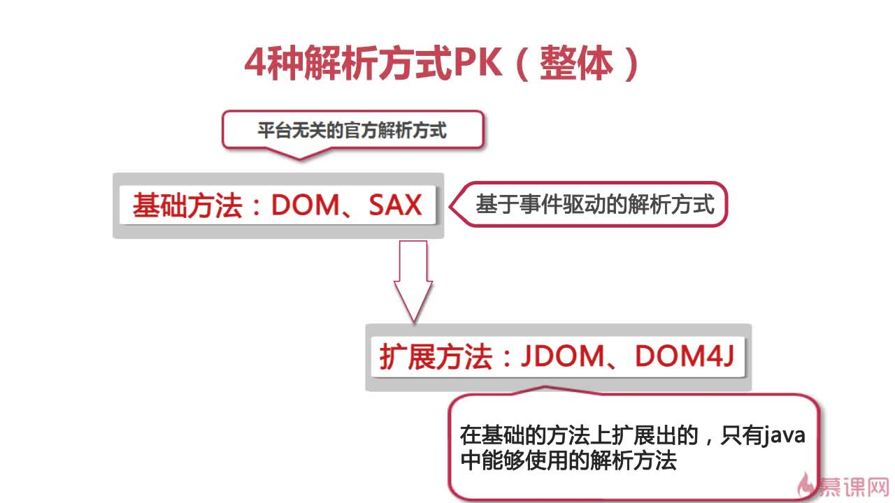
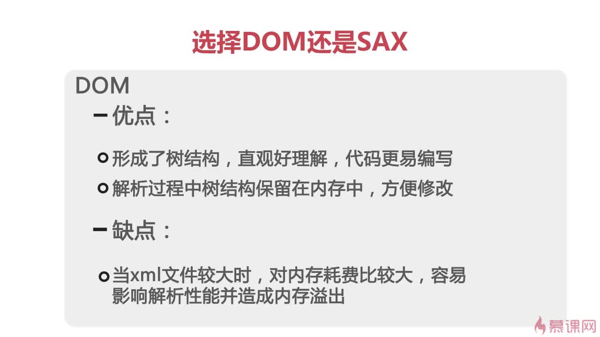
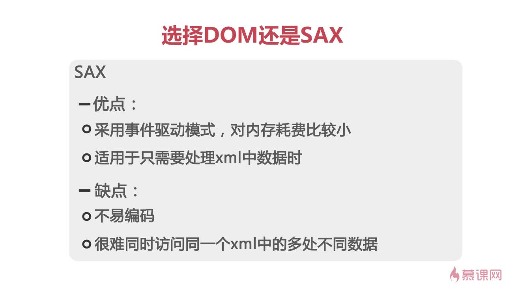
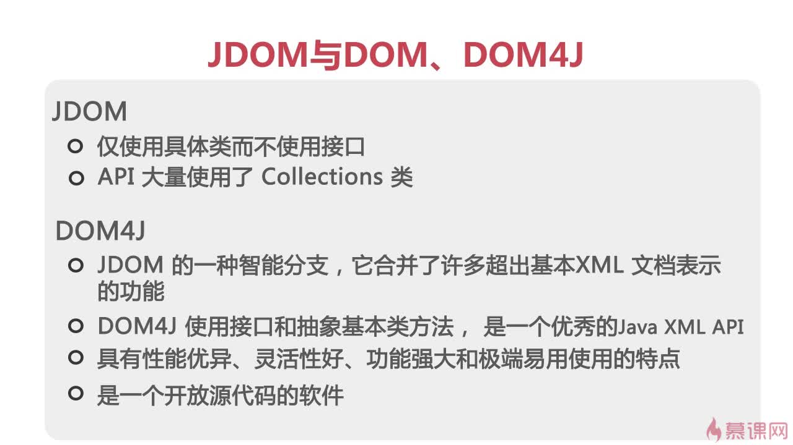

# [XML 解析](https://www.imooc.com/learn/171)

四种解析方式：

- DOM
- SAX
- DOM4J
- JDOM

## 1. 应用 DOM 方式解析 XML

```java
DocumentBuilderFactory dbf = DocumentBuilderFactory.newInstance();
try {
    DocumentBuilder db = dbf.newDocumentBuilder();
    Document document = db.parse("books.xml");
    NodeList bookList = document.getElementsByTagName("book");
    // ...
} catch (ParserConfigurationException | SAXException | IOException e) {
    e.printStackTrace();
}
```

```java
for (int i = 0; i < bookList.getLength(); i++) {
    Node bookNode = bookList.item(i);
    NamedNodeMap attrs = bookNode.getAttributes();
    System.out.println("第" + (i + 1) + "本书共有" + attrs.getLength() + "个属性");
    NodeList childList = bookNode.getChildNodes();
    System.out.println("第" + (i + 1) + "本书共有" + childList.getLength() + "个子节点");
}
```

```java
for (int j = 0; j < attrs.getLength(); j++) {
    Node attrNode = attrs.item(j);
    System.out.println("第" + (j + 1) + "个属性名：" + attrNode.getNodeName()
            + "，属性值：" + attrNode.getNodeValue());
}
```

```java
Element bookElement = (Element) bookList.item(i);
String attrValue = bookElement.getAttribute("id");
System.out.println("属性名：id，属性值：" + attrValue);
```

```java
for (int j = 0; j < childList.getLength(); j++) {
    Node childNode = childList.item(j);
    if (childNode != null && childNode.getNodeType() == Node.ELEMENT_NODE) {
        System.out.println("第" + (j + 1) + "个子节点名：" + childNode.getNodeName()
                + "，子节点值：" + childNode.getFirstChild().getNodeValue());
    }
}
```

```java
DOM解析开始
一共有2本书
第1本书共有1个属性
第1个属性名：id，属性值：1
第1本书共有9个子节点
第2个子节点名：name，子节点值：冰与火之歌
第4个子节点名：author，子节点值：乔治马丁
第6个子节点名：year，子节点值：2014
第8个子节点名：price，子节点值：89
第2本书共有1个属性
第1个属性名：id，属性值：2
第2本书共有9个子节点
第2个子节点名：name，子节点值：安徒生童话
第4个子节点名：year，子节点值：2004
第6个子节点名：price，子节点值：77
第8个子节点名：language，子节点值：English
DOM解析结束
```

## 2. 应用 SAX 方式解析 XML

### 2.1. 输出解析内容

```java
SAXParserFactory spf = SAXParserFactory.newInstance();
try {
    SAXParser saxParser = spf.newSAXParser();
    SaxParserHandler handler = new SaxParserHandler();
    saxParser.parse("books.xml", handler);
} catch (ParserConfigurationException | SAXException | IOException e) {
    e.printStackTrace();
}
```

```java
static class SaxParserHandler extends DefaultHandler {
    String bookstoreString = "bookstore";
    String bookString = "book";
    int bookstoreIndex = 0;
    int bookIndex = 0;
    int childIndex = 0;
    // ...
}
```

```java
public void startElement(String uri, String localName, String qName,
                         Attributes attributes)
        throws SAXException {
    super.startElement(uri, localName, qName, attributes);
    if (bookstoreString.equals(qName)) {
        bookstoreIndex++;
        bookIndex = 0;
    } else if (bookString.equals(qName)) {
        bookIndex++;
        childIndex = 0;
        System.out.println("第" + bookIndex + "本书共有" + attributes.getLength() + "个属性");
        for (int i = 0; i < attributes.getLength(); i++) {
            System.out.println("第" + (i + 1) + "个属性名：" + attributes.getQName(i)
                    + "，属性值：" + attributes.getValue(i));
        }
    } else {
        childIndex++;
        System.out.print("第" + childIndex + "个子节点名：" + qName);
    }
}
```

```java
public void endElement(String uri, String localName, String qName)
        throws SAXException {
    super.endElement(uri, localName, qName);
    if (bookstoreString.equals(qName)) {
        System.out.println("一共有" + bookIndex + "本书");
    } else if (bookString.equals(qName)) {
        System.out.println("第" + bookIndex + "本书共有" + childIndex + "个子节点");
    }
}
```

```java
public void characters(char[] ch, int start, int length) throws SAXException {
    super.characters(ch, start, length);
    String value = new String(ch, start, length);
    if (!"".equals(value.trim())) {
        System.out.println("，节点值：" + value);
    }
}
```

```java
SAX解析开始
第1本书共有1个属性
第1个属性名：id，属性值：1
第1个子节点名：name，节点值：冰与火之歌
第2个子节点名：author，节点值：乔治马丁
第3个子节点名：year，节点值：2014
第4个子节点名：price，节点值：89
第1本书共有4个子节点
第2本书共有1个属性
第1个属性名：id，属性值：2
第1个子节点名：name，节点值：安徒生童话
第2个子节点名：year，节点值：2004
第3个子节点名：price，节点值：77
第4个子节点名：language，节点值：English
第2本书共有4个子节点
一共有2本书
SAX解析结束
```

### 2.2. 使用 Java 对象保存

```java
public class Book {
    private String id;
    private String name;
    private String author;
    private String year;
    private String price;
    private String language;
    // ...
}
```

```java
static class SaxParserHandler extends DefaultHandler {
    String bookString = "book";
    String idString = "id";
    String nameString = "name";
    String authorString = "author";
    String yearString = "year";
    String priceString = "price";
    String languageString = "language";
    List<Book> bookList = new ArrayList<>();
    int bookIndex = 0;
    Book book = null;
    String currentValue = null;
    // ...
}
```

```java
public void startElement(String uri, String localName, String qName,
                         Attributes attributes)
        throws SAXException {
    super.startElement(uri, localName, qName, attributes);
    if (bookString.equals(qName)) {
        bookIndex++;
        book = new Book();
        for (int i = 0; i < attributes.getLength(); i++) {
            if (idString.equals(attributes.getQName(i))) {
                book.setId(attributes.getValue(i));
            }
        }
    }
}
```

```java
public void endElement(String uri, String localName, String qName)
        throws SAXException {
    super.endElement(uri, localName, qName);
    if (bookString.equals(qName)) {
        bookList.add(book);
        book = null;
    } else if (nameString.equals(qName)) {
        book.setName(currentValue);
    } else if (authorString.equals(qName)) {
        book.setAuthor(currentValue);
    } else if (yearString.equals(qName)) {
        book.setYear(currentValue);
    } else if (priceString.equals(qName)) {
        book.setPrice(currentValue);
    } else if (languageString.equals(qName)) {
        book.setLanguage(currentValue);
    }
}
```

```java
public void characters(char[] ch, int start, int length) throws SAXException {
    super.characters(ch, start, length);
    currentValue = new String(ch, start, length);
}
```

```java
Book{id='1', name='冰与火之歌', author='乔治马丁', year='2014', price='89', language='null'}
Book{id='2', name='安徒生童话', author='null', year='2004', price='77', language='English'}
```

## 3. 应用 DOM4J 及 JDOM 方式解析 XML

### 3.1. 应用 JDOM 方式解析

```java
SAXBuilder saxBuilder = new SAXBuilder();
InputStream in;
try {
    in = new FileInputStream("books.xml");
    Document document = saxBuilder.build(in);
    Element rootElement = document.getRootElement();
    List<Element> bookList = rootElement.getChildren();
    // ...
} catch (JDOMException | IOException e) {
    e.printStackTrace();
}
```

```java
List<Attribute> attributeList = book.getAttributes();
System.out.println("第" + (bookList.indexOf(book) + 1) + "本书共有" + attributeList.size() + "个属性");
for (Attribute attr : attributeList) {
    System.out.println("第" + (attributeList.indexOf(attr) + 1) + "个属性名：" + attr.getName()
            + "，属性值：" + attr.getValue());
}
```

```java
System.out.println("属性名：id，属性值：" + book.getAttributeValue("id"));
```

```java
List<Element> childList = book.getChildren();
System.out.println("第" + (bookList.indexOf(book) + 1) + "本书共有" + childList.size() + "个子节点");
for (Element child : childList) {
    System.out.println("第" + (childList.indexOf(child) + 1) + "个子节点名：" + child.getName()
            + "，子节点值：" + child.getValue());
}
```

```java
JDOM解析开始
第1本书共有1个属性
第1个属性名：id，属性值：1
第1本书共有4个子节点
第1个子节点名：name，子节点值：冰与火之歌
第2个子节点名：author，子节点值：乔治马丁
第3个子节点名：year，子节点值：2014
第4个子节点名：price，子节点值：89
第2本书共有1个属性
第1个属性名：id，属性值：2
第2本书共有4个子节点
第1个子节点名：name，子节点值：安徒生童话
第2个子节点名：year，子节点值：2004
第3个子节点名：price，子节点值：77
第4个子节点名：language，子节点值：English
JDOM解析结束
```

```java
in = new FileInputStream("books.xml");
Document document = saxBuilder.build(in);
Element rootElement = document.getRootElement();
List<Element> bookList = rootElement.getChildren();
for (Element book : bookList) {
    bookEntity = new Book();
    List<Attribute> attributeList = book.getAttributes();
    for (Attribute attr : attributeList) {
        if (idString.equals(attr.getName())) {
            bookEntity.setId(attr.getValue());
        }
    }
    List<Element> childList = book.getChildren();
    for (Element child : childList) {
        if (nameString.equals(child.getName())) {
            bookEntity.setName(child.getValue());
        } else if (authorString.equals(child.getName())) {
            bookEntity.setAuthor(child.getValue());
        } else if (yearString.equals(child.getName())) {
            bookEntity.setYear(child.getValue());
        } else if (priceString.equals(child.getName())) {
            bookEntity.setPrice(child.getValue());
        } else if (languageString.equals(child.getName())) {
            bookEntity.setLanguage(child.getValue());
        }
    }
    bookEntityList.add(bookEntity);
}
```

### 3.2. 乱码问题

```xml
<?xml version="1.0" encoding="ISO-8859-1"?>
<bookstore>
  <book id="1">
    <name>冰与火之歌</name>
    <author>乔治马丁</author>
    <year>2014</year>
    <price>89</price>
  </book>
  <book id="2">
    <name>安徒生童话</name>
    <year>2004</year>
    <price>77</price>
    <language>English</language>
  </book>
</bookstore>
```

```java
in = new FileInputStream("books2.xml");
InputStreamReader isr = new InputStreamReader(in, StandardCharsets.UTF_8);
Document document = saxBuilder.build(isr);
```

### 3.3. 应用 DOM4J 方式解析

```java
SAXReader reader = new SAXReader();
int bookIndex = 0;
int attributeIndex = 0;
int childIndex = 0;
```

```java
try {
    Document document = reader.read(new File("books.xml"));
    Element bookStore = document.getRootElement();
    Iterator iterator = bookStore.elementIterator();
    while (iterator.hasNext()) {
        bookIndex++;
        attributeIndex = 0;
        childIndex = 0;
        // ...
    }
} catch (DocumentException e) {
    e.printStackTrace();
}
```

```java
Element book = (Element) iterator.next();
List<Attribute> bookAttrs = book.attributes();
for (Attribute attr : bookAttrs) {
    attributeIndex++;
    System.out.println("属性名：" + attr.getName() + "，属性值：" + attr.getValue());
}
```

```java
Iterator iterator2 = book.elementIterator();
while (iterator2.hasNext()) {
    childIndex++;
    Element bookChild = (Element) iterator2.next();
    System.out.println("节点名：" + bookChild.getName() + "，节点值：" + bookChild.getStringValue());
}
```

```java
属性名：id，属性值：1
节点名：name，节点值：冰与火之歌
节点名：author，节点值：乔治马丁
节点名：year，节点值：2014
节点名：price，节点值：89
属性名：id，属性值：2
节点名：name，节点值：安徒生童话
节点名：year，节点值：2004
节点名：price，节点值：77
节点名：language，节点值：English
```

## 4. 四种 XML 解析方式 PK








